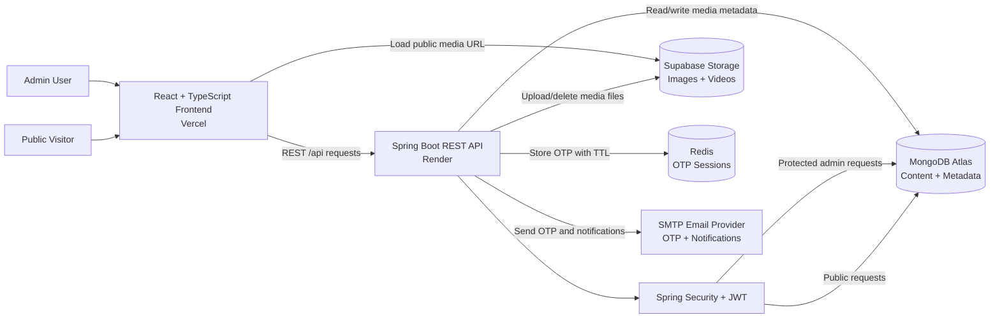
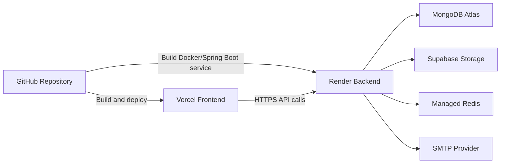
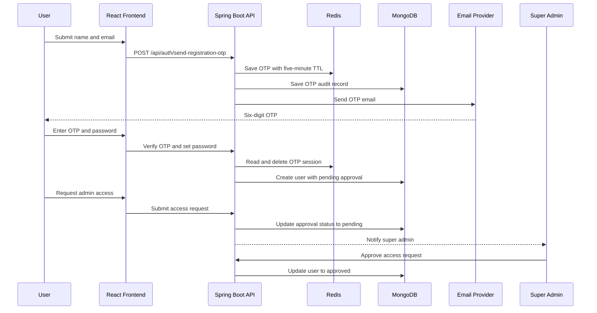
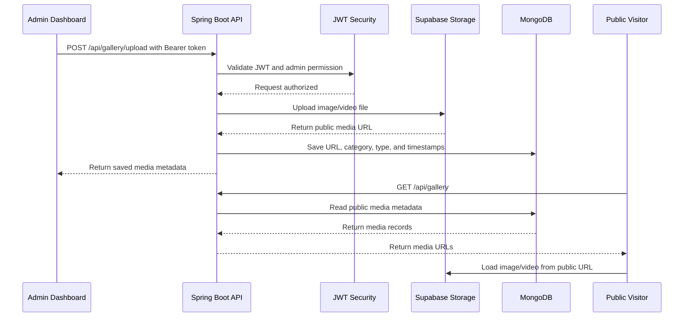
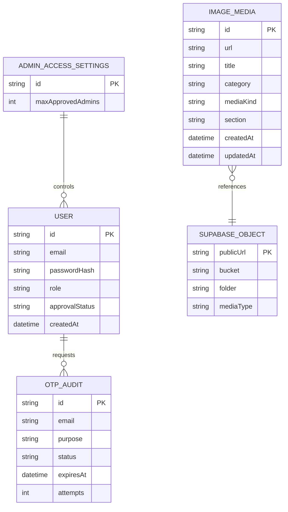

# Visualnest

Visualnest is a full-stack photography portfolio and gallery management platform built for a photography client. It combines a public-facing portfolio website with a secure admin dashboard for managing media, website content, contact details, and access requests.

## Project Context

This project was developed as a client project for a photography business. The goal was to replace a static portfolio with a responsive, content-managed website where the client can update images, videos, profile information, services, and contact details without changing the source code.

## Live Demo and Video

- Repository: https://github.com/Yashgoswami-ds/visualnest
- Frontend demo: To be added after deployment
- Backend API: To be added after deployment
- Demo video and project assets: [Google Drive folder](https://drive.google.com/drive/folders/15S8zculoeq7UxnfwgDC5QiIhHsY4xB--)

### Demo and Loading Note

The backend is deployed on Render, which may go into sleep mode when it is not used. Because of this, the first request can take a little longer while the service performs a cold start. Images and videos are stored in Supabase Storage, so media may also take a few seconds to load on the first visit. Please wait briefly and refresh once if the backend is waking up.

## Main Features

### Public Website

- Responsive home page with editable hero media
- About page with editable profile information and media
- Services page for presenting photography services
- Gallery with category filtering and load-more behavior
- Separate video gallery with video playback controls
- Contact page with enquiry form
- Dynamic location, email, phone, and Instagram details
- Responsive layout for desktop, tablet, and mobile devices

### Admin Dashboard

- Secure admin login using JWT authentication
- Protected admin routes
- New user registration with email OTP verification
- Login OTP verification flow
- Forgot-password and password-reset flows
- Admin access request and approval workflow
- Upload images and videos
- Edit media title, category, and metadata
- Delete media with confirmation
- Manage home hero and about profile media
- Edit about and contact page content
- Create, edit, and delete custom gallery categories
- Dashboard statistics for media and access requests
- OTP audit records for admin review

## Technology Stack

### Frontend

- React 19, TypeScript, and Vite
- React Router for client-side navigation
- Mantine UI components and hooks
- Tailwind CSS integration
- ESLint for code quality

### Backend

- Java 21 and Spring Boot 3.3
- Spring Web REST APIs
- Spring Security and JWT authentication
- Spring Data MongoDB
- Spring Boot Mail and Jakarta Validation
- JJWT for JSON Web Tokens
- Springdoc OpenAPI and Swagger UI
- Maven

### Data and Infrastructure

- MongoDB Atlas for application data
- Supabase Storage for persistent image and video files
- Gmail SMTP or compatible SMTP provider for OTP and notification emails
- Render for backend deployment
- Vercel for frontend deployment
- Docker support for backend deployment

## Application Flow

### Overall System Architecture



### Deployment Flow



### Public Visitor Flow

1. Visitor opens the home page.
2. Frontend requests public content and gallery data from the backend API.
3. Backend reads content and media metadata from MongoDB.
4. Media files are loaded from Supabase Storage or the configured local upload directory.
5. Visitor can browse categories, view images and videos, and submit a contact enquiry.

### Registration and Access Flow

1. A new user enters a name and email address.
2. Backend generates a six-digit OTP and stores a short-lived OTP audit record.
3. Email service sends the OTP through SMTP.
4. User verifies the OTP and creates a password.
5. User submits an admin access request.
6. Super admin reviews the request in the dashboard.
7. After approval, the user can log in and receive a JWT token.



### Login Flow

1. User submits email and password.
2. Backend validates the account, password, approval status, and account state.
3. Backend returns a JWT token for approved accounts.
4. Frontend stores the token and sends it in the `Authorization: Bearer <token>` header for protected requests.

### Media Management Flow

1. Admin selects an image or video and a gallery category.
2. Frontend sends a multipart upload request with the JWT token.
3. Backend validates the file type and creates a unique stored filename.
4. File is uploaded to Supabase Storage when the Supabase provider is enabled.
5. Media URL, title, category, type, and timestamps are saved in MongoDB.
6. Public gallery APIs return the saved metadata to the frontend.



### Data and Storage Relationship



MongoDB stores application records and media metadata. Supabase stores the binary image/video objects. Redis stores temporary OTP sessions with automatic expiry, while MongoDB keeps the audit history.

## API Overview

The backend uses REST APIs under the `/api` prefix.

### Public APIs

| Method | Endpoint | Purpose |
| --- | --- | --- |
| GET | `/api/gallery` | Return all public media |
| GET | `/api/gallery/images` | Return image media |
| GET | `/api/gallery/videos` | Return video media |
| GET | `/api/gallery/{category}` | Return media by category |
| GET | `/api/content/about` | Return about-page content |
| GET | `/api/content/contact` | Return contact-page content |
| GET | `/api/content/services` | Return services content |
| POST | `/api/contact/query` | Submit a contact enquiry |

### Authentication APIs

| Method | Endpoint | Purpose |
| --- | --- | --- |
| POST | `/api/auth/login` | Authenticate an approved user |
| POST | `/api/auth/send-registration-otp` | Send registration OTP |
| POST | `/api/auth/verify-registration-otp` | Verify registration OTP |
| POST | `/api/auth/set-registration-password` | Complete account setup |
| POST | `/api/auth/forgot-password-otp` | Send password reset OTP |
| POST | `/api/auth/reset-password-otp` | Reset password using OTP |
| POST | `/api/auth/request-access` | Submit an admin access request |
| GET | `/api/auth/validate` | Validate the current JWT session |

### Protected Admin APIs

| Method | Endpoint | Purpose |
| --- | --- | --- |
| POST | `/api/gallery/upload` | Upload image or video media |
| PUT | `/api/gallery/{id}` | Update media metadata |
| DELETE | `/api/gallery/{id}` | Delete media |
| GET | `/api/admin/access/pending` | View pending access requests |
| POST | `/api/admin/access/approve/{email}` | Approve an access request |
| DELETE | `/api/admin/access/reject/{email}` | Reject an access request |
| GET | `/api/admin/otp-audit` | View OTP audit records |

Swagger documentation is available at `/swagger-ui.html` when the backend is running.

## Repository Structure

```text
visualnest/
|-- backend/
|   |-- src/main/java/com/photfolio/backend/
|   |   |-- config/       Security, mail, CORS, and application configuration
|   |   |-- controller/   REST API controllers
|   |   |-- model/        MongoDB documents and request models
|   |   |-- repository/   Spring Data MongoDB repositories
|   |   |-- service/      Authentication, mail, content, and gallery logic
|   |-- Dockerfile
|   |-- pom.xml
|-- frontend/
|   |-- src/components/   Reusable UI components
|   |-- src/pages/        Public and admin pages
|   |-- src/services/     Frontend API client
|   |-- src/styles/       Page and component styles
|   |-- package.json
|-- README.md
```

## Local Setup

### Prerequisites

- Node.js 20 or later
- Java 21
- Maven 3.9 or later
- MongoDB or MongoDB Atlas account
- SMTP credentials for OTP emails

### Backend

```powershell
cd backend
mvn spring-boot:run
```

The backend runs on `http://localhost:8081`.

### Frontend

Create `frontend/.env` from `frontend/.env.example`:

```env
VITE_API_URL=http://localhost:8081/api
```

Then run:

```powershell
cd frontend
npm install
npm run dev
```

The frontend runs on `http://localhost:5173`.

## Environment Variables

### Backend Required Variables

```env
SPRING_DATA_MONGODB_URI=mongodb+srv://...
JWT_SECRET=use-a-long-random-secret-at-least-64-characters
```

### Email Variables

```env
MAIL_USERNAME=your-email@example.com
MAIL_APP_PASSWORD=your-smtp-or-gmail-app-password
APP_ADMIN_EMAIL=admin@example.com
```

### Redis OTP Session Variables

Use a managed Redis instance in production so pending OTP sessions survive backend restarts:

```env
APP_OTP_STORE=redis
REDIS_HOST=your-redis-host
REDIS_PORT=6379
REDIS_PASSWORD=your-redis-password
REDIS_SSL=true
```

For local development, keep `APP_OTP_STORE=memory` or run Redis locally. OTP sessions stored in memory are cleared when the backend restarts.

### Supabase Storage Variables

```env
APP_STORAGE_PROVIDER=supabase
APP_STORAGE_SUPABASE_URL=https://your-project.supabase.co
APP_STORAGE_SUPABASE_SERVICE_KEY=your-service-role-key
APP_STORAGE_SUPABASE_BUCKET=your-public-bucket
APP_STORAGE_SUPABASE_FOLDER=gallery
```

Never commit real environment values, database URLs, SMTP passwords, JWT secrets, or Supabase service keys to the repository.

## Build and Validation

```powershell
cd frontend
npm run lint
npm run build

cd ../backend
mvn -DskipTests clean package
```

## Deployment

- Deploy the backend as a Render Web Service or with the included Dockerfile.
- Set the backend environment variables in Render.
- Deploy the frontend to Vercel.
- Set `VITE_API_URL` in Vercel to the deployed backend URL ending in `/api`.
- Configure CORS with the deployed frontend domain.
- Use Supabase Storage for persistent media because free hosting disks can be ephemeral.

## Security Notes

- Passwords are hashed before storage.
- Admin endpoints require JWT authentication.
- OTPs expire after a short time and are tracked in audit records.
- User-provided HTML content is escaped before being placed in email templates.
- Uploads are validated as image or video content.
- Secrets are supplied through environment variables.

## Future Improvements

- Add automated backend unit and integration tests.
- Move pending OTP sessions from in-memory storage to a persistent store.
- Add image resizing and optimization before storage.
- Add role-based permissions for different admin levels.
- Add analytics for gallery views and contact enquiries.
- Add the project walkthrough video link in the Live Demo and Video section above.

## Client Project Outcome

Visualnest provides the client with a maintainable photography portfolio, a secure content management workflow, persistent media storage, and a simple admin experience for updating the website without developer assistance.